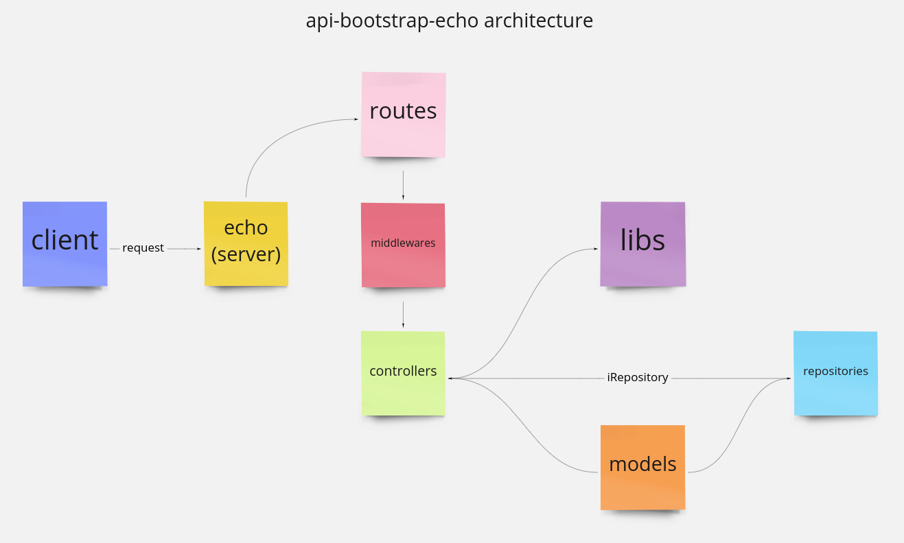

# api-bootstrap-echo


Golang microservices template build with echo server. This code base allows OCC developers to create a new microservice with minimum a code modification and using the best practices.

*This is the description section, when you can add all the basic information about your microservice, the name explanation, the service functions, ADR, all kind of useful diagrams. You can use the next way to import an image:*



## <a id="contents">☕ Contents</a>

*A Contents sections is useful if your readme gets longer, but you can omit it.*

* [Quickstart](#quickstart)
* [Environments](#environments)
* [CI/CD](#cicd)
* [Installation](#installation)
* [Configuration](#configuration)
* [Usage](#usage)
* [Contribute](#contribute)

## <a id="quickstart">⚡️ Quickstart</a>

*This section is very important. The idea of this section is list all the steps needed to prepare and start the microservice in a local machine.*

  - Install `Go 1.16+`.
  - Clone this repository in your `$GOPATH` path.
  - Source the environment variables from file `./config/.dev.env`
  - Set the next environment variables:
    - `LOG_LEVEL` Configures the log level. Possible values: `TRACE`, `DEBUG` (default), `INFO`, `WARN`, `ERROR`.
  - Run the command: `go run main.go`

## <a id="environments">🌱 Environments</a>

*This section lists all the service environments, useful for sharing with your service clients. You can omit this section if you generate the environments by using the widdershins utility.*

### Local

    http://localhost:4001
    
### Development

    http://api-bootstrap-echo.svc.dev.occ

### Production

    http://api-bootstrap-echo.svc.occ

## <a id="cicd">🤖 CI/CD</a>

*This section lists the CI/CD pages. The next pages are only for visualisation propose.*

### CI

- [api-bootstrap-echo](https://ci.occdeep.io/occmundial/api-bootstrap-echo)

### CD

 - [Development](https://argocd-dev.occdev.com.mx/applications/api-bootstrap-echo)
 - [Production](https://ragnar-cd.occdeep.io/applications/api-bootstrap-echo)

## <a id="installation">‍💻 Installation</a>

*This section has the complete steps from the Quickstart section but in detail. At the end of this section you can add any custom steps for your microservice.*

To run this API locally, please make sure you have the next dependencies:

 - Go 1.16+

And ensure that the `go` command is available in the current path by running the command:

    go version

You must get a similar output like the next:

    go version go1.16.14 windows/amd64

Then, clone this repository in your `GOPATH` and run the next command to get the project dependencies:

    go mod tidy

Finally, you can run the project by simply invoke:

    go run main.go

Or by building the go solution and running the executable:

    go build
    ./api-bootstrap-echo.exe

For Linux and Unix derivated:

    go build
    ./api-bootstrap-echo

For all the cases, you need to configure the project, please refer to the next section.

## <a id="configuration">⚙️ Configuration</a>

*This section explains the environment variables or dependencies needed to run the microservice. Is a continuation of the Installation section. At the end of this section you can add any custom configuration for your microservice.*

Configure the required environment variables by sourcing the values from `./config/?.env`, where `?` is the desired environment, like `.dev.env`. By default, all the configuration listed in `./config/config.json` is loaded by default and override by environment variables.

**NOTE:** All sensitive information (called secrets) such as user names, passwords or tokens used to connect to databases, services and another credentials are not stored in any file of this repository. Please check the required secrets with your tech lead.

The log level could be configured with the next environment variable:

- `LOG_LEVEL` Configures the log level. Possible values: `TRACE`, `DEBUG` (default), `INFO`, `WARN`, `ERROR`.

## <a id="usage">👀 Usage</a>

*This section will list all the endpoints available in your microservice. You can use the widdershins utility within the modified template to copy all the generated MD and paste here. A few examples for /health and /metrics are shown below:*

<h1 id="api-hirers-genesis-healthcheck">healthcheck</h1>

Health check resources

### Get the health of the service

<a id="opIdGetHealth"></a>

`GET /health`

Get the health of the service

> Example responses

> 200 Response

```json
{
  "componentName": "api-hirers-genesis",
  "status": "pass",
  "version": "1.12.5e65764"
}
```

<h3 id="get-the-health-of-the-service-responses">Responses</h3>

|Status|Meaning|Description|
|---|---|---|
|200|[OK](https://tools.ietf.org/html/rfc7231#section-6.3.1)|OK. Everything is fine.|

<aside class="success">
This operation does not require authentication
</aside>

### Get the health of the service and its dependencies

<a id="opIdGetHealthWithDependencies"></a>

`GET /health/dependencies`

Get the health of the service and its dependencies

> Example responses

> 200 Response

```json
{
  "componentName": "api-hirers-genesis",
  "status": "pass",
  "version": "1.12.5e65764",
  "output": "Service is UP",
  "dependencies": [
    {
      "componentName": "documentDB",
      "status": "pass",
      "componentType": "repository",
      "output": "Everything is fine",
      "critical": true
    }
  ]
}
```

> 504 Response

```json
{
  "componentName": "api-hirers-genesis",
  "status": "fail",
  "version": "1.12.5e65764",
  "output": "Service is down",
  "dependencies": [
    {
      "componentName": "documentDB",
      "status": "fail",
      "componentType": "repository",
      "output": "Error connecting to 127.0.0.1:27017 :: caused by :: Connection refused",
      "critical": true
    }
  ]
}
```

<h3 id="get-the-health-of-the-service-and-its-dependencies-responses">Responses</h3>

|Status|Meaning|Description|
|---|---|---|
|200|[OK](https://tools.ietf.org/html/rfc7231#section-6.3.1)|OK. Everything is fine.|
|504|[Gateway Time-out](https://tools.ietf.org/html/rfc7231#section-6.6.5)|Gateway Timeout. A problem ocurred while requesting dependencies.|

<aside class="success">
This operation does not require authentication
</aside>

<h1 id="api-hirers-genesis-metrics">metrics</h1>

Prometheus metrics resource

### Get the prometheus metrics

<a id="opIdGetMetrics"></a>

`GET /metrics`

Get the prometheus metrics

> Example responses

> 200 Response

```
"# HELP echo_request_duration_seconds The HTTP request latencies in seconds.\n# TYPE echo_request_duration_seconds histogram\necho_request_duration_seconds_bucket{code=\"200\",method=\"GET\",url=\"/bootstrap/endpoint/:id\",le=\"0.005\"} 2\n"
```

<h3 id="get-the-prometheus-metrics-responses">Responses</h3>

|Status|Meaning|Description|
|---|---|---|
|200|[OK](https://tools.ietf.org/html/rfc7231#section-6.3.1)|OK|

<aside class="success">
This operation does not require authentication
</aside>

## <a id="contribute">👍 Contribute</a>

*This section is intended to explain additional information of how to modify your microservice.*

To contribute to this project, please create a new branch from `development` with the structure of: `<username>/<change type>/<change name>`, for example: `lneeson/feature/createEndpoint`

### 📖 docs

The file `.docs/oas3.yml` could be loaded in the [Swagger online editor](https://editor.swagger.io/). Modify acording the Open API specification.

In order to update the usage section from the oas3.yml file, install the tool [widdershins](https://github.com/Mermade/widdershins), the run the next command:

    widdershins --search false --code true --user_templates ./docs/openapi3 --summary ./docs/oas3.yaml -o oas3.md --omitHeader true

Then, replace the usage section by the contents of `oas3.md` file .
